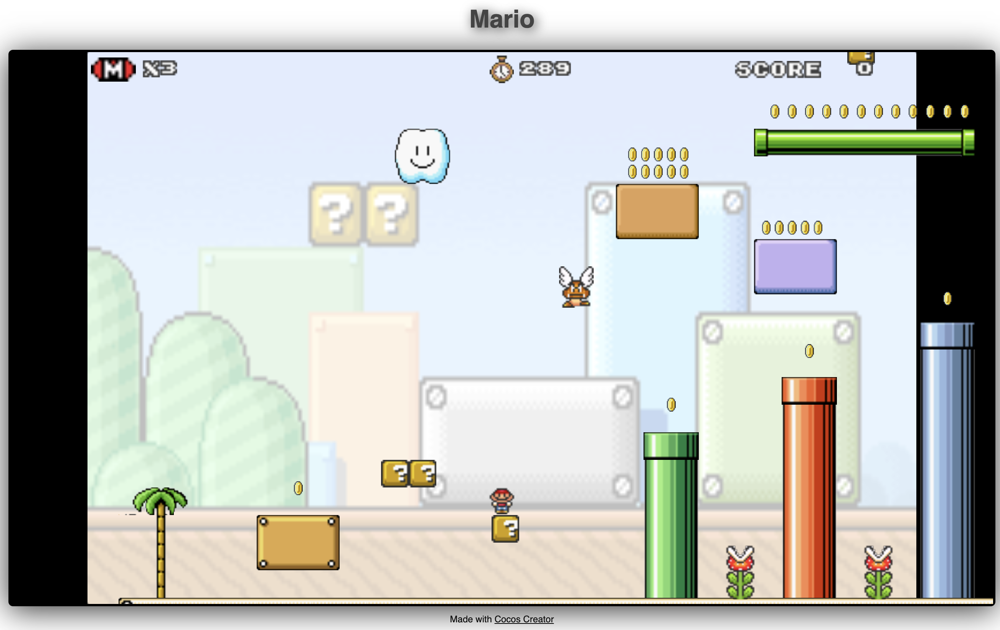
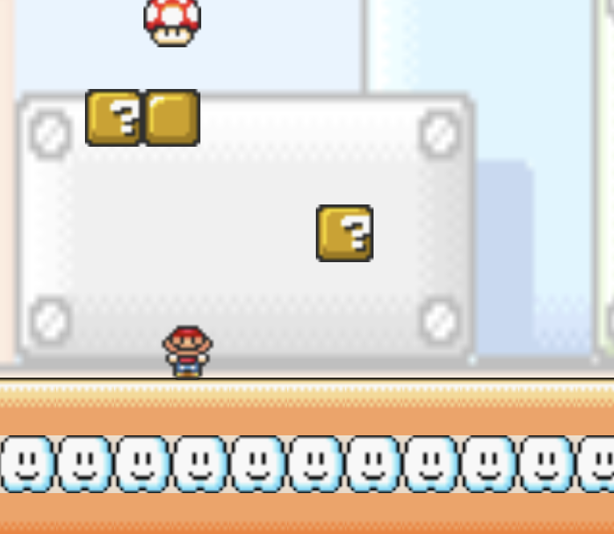
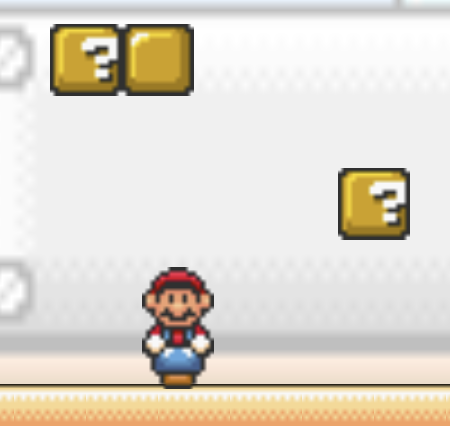
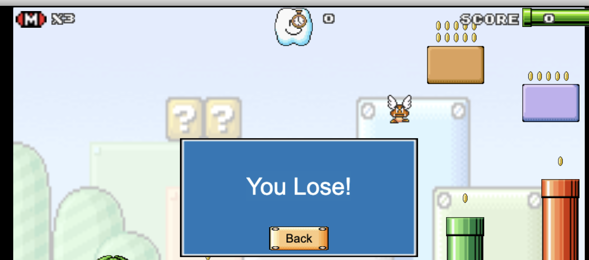
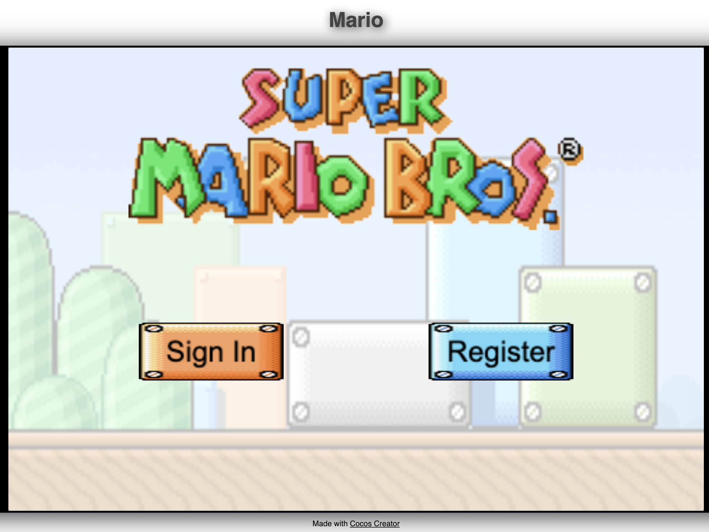
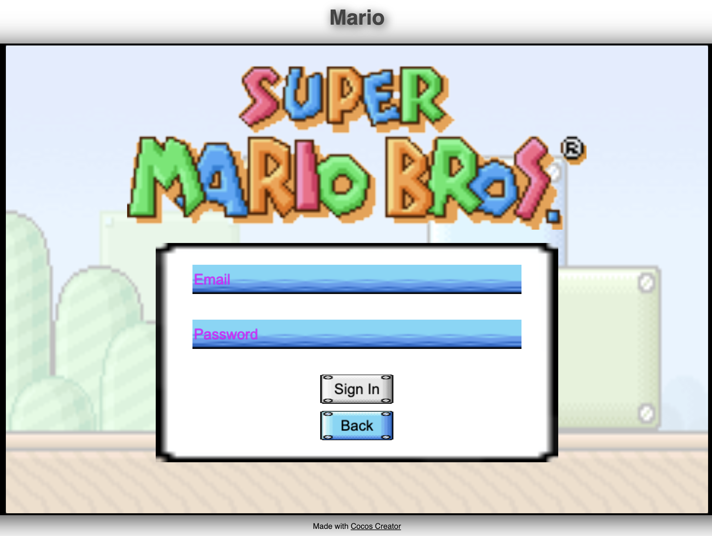
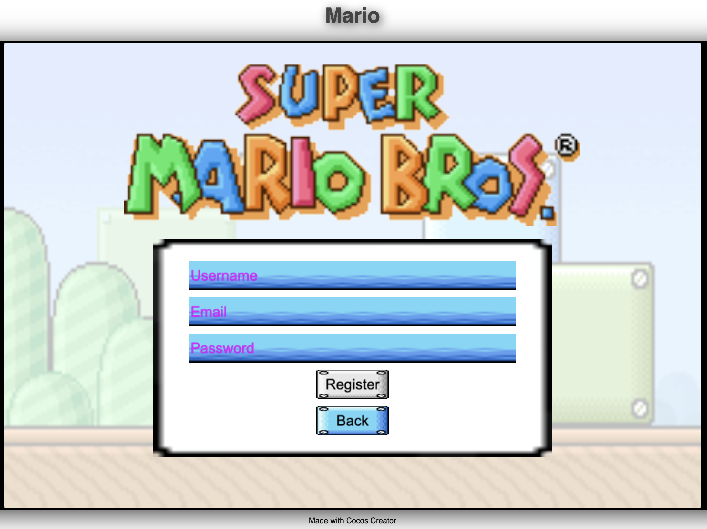
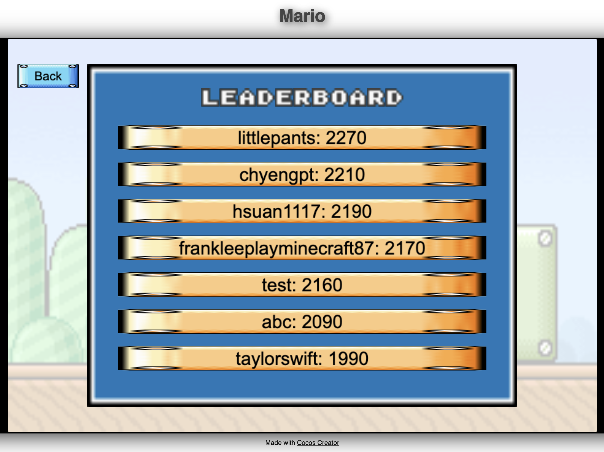

# Software Studio 2024 Spring Assignment 2

## Student ID : 111000223 Name : 黃頂軒

### Scoring

| **Basic Component** | **Score** | **Check** |
| :---: | :---: | :---: |
| Complete Game Process | 5% | Y |
| Basic Rules | 55% | Y |
| Animations | 10% | Y |
| Sound Effects | 10% | Y |
| UI | 10% | Y |

| **Advanced Component** | **Score** | **Check** |
| :---: | :---: | :---: |
| Firebase Deploy | 5% | Y |
| Leaderboard | 5% | Y |
| Offline multi-player game | 5% | N |
| Online multi-player game | 10% | N |
| Others [name of functions] | 1-10% | N |

---

## Basic Components Description: 

### Complete Game Process

#### Start Menu

You can select `start` or `leaderboard`. `start` button will take you to the level select scene, and `leaderboard` button will take you to the leaderboard scene.

#### Level Select

After clicking the `start` button in the start menu, you will be taken to this scene, where you can select the level you want to play.

#### Game View

This is the start of the game. You can move the player with arrow keys.

These are the result pages when you win/lose.

| Win | Lose |
| :--: | :-: |
|  |  |

### Basic Rules

#### World Map

- There are two levels in total.
- Physic properties are implemented, therefore player and objects will fall due to gravity, and collide with each other correctly.
- The camera will follow the player's position, keeping Mario in the center of the screen.

#### Level Design

The level is built from combining different components.

#### Player

- Control with arrow keys.
- When the player touches enemies or fall out of bounds, the number of its life will decrease.
- Reborn at the initial position after player dies.

#### Enemies

There are three types of enemy.

| Goomba | Flying Goomba | Flower |
| :---: | :---: | :---: |
|  |  |  |
| Goomba will walk left and right randomly. Player can kill Goomba if you hits on its head. | Flying Goomba will fly in the air, using `cc.Animation` effect with `easeInOut` to smooth out when changing direction. Player can kill Flying Goomba if you hits on its head. | Flower will not move, however if you touch it you will die immediately, regardless of power ups. Flowers are immortal, which means you can not kill flowers. |

#### Question Blocks

The question blocks can interact with the player. If the player hit the question block from below, it will generate either `coin`, `powerup mushroom`, or `health mushroom` item. Player can stand on the question block.

After eating `powerup mushroom`, Mario switch to powerup mode and becomes bigger. It is also invincible on powerup mode.

### Animation

- Player has walk & jump animation on both non-powerup/powerup mode.
- All $3$ enemies has animation. Flying Goomba will flap its wings, flower will chomp, and goomba will move around.
- Coin spinning animation.
- Question block animation.

### Sound Effects

- BGM sound effect
- Player jump & die sound effects
- Additional sound effects:
  - Win (levelClear) sound effect
  - Collecting coins sound effect
  - Stomp sound effect
  - Kill enemies sound effect
  - Powerup sound effect

### UI

- Player life: Player dies when no life remain.
- Player score: Score that player obtained by collecting coins or kill enemies.
- Timer: Player loses when timer count down to $0$ seconds.

### Bonus

#### Firebase

- Deploy to firebase page. [Game URL](https://felix-mario.web.app/).
- Membership mechanism

You need to have an authentication to enter the game. You can either sign in if you have an account or register a new account.

| Sign In | Register |
| :-----: | :------: |
|  |  |

Passwords should have length greater than $6$.

#### Leaderboard

Leaderboard will display top $7$ users with highest scores.

# Firebase page link (if you deploy)

[Game URL](https://felix-mario.web.app/)