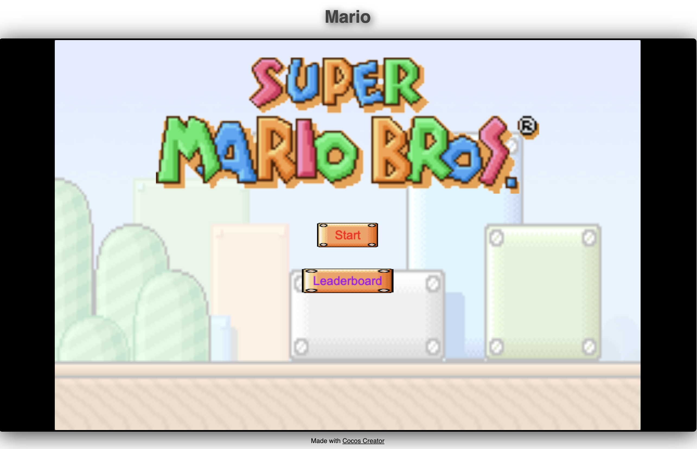
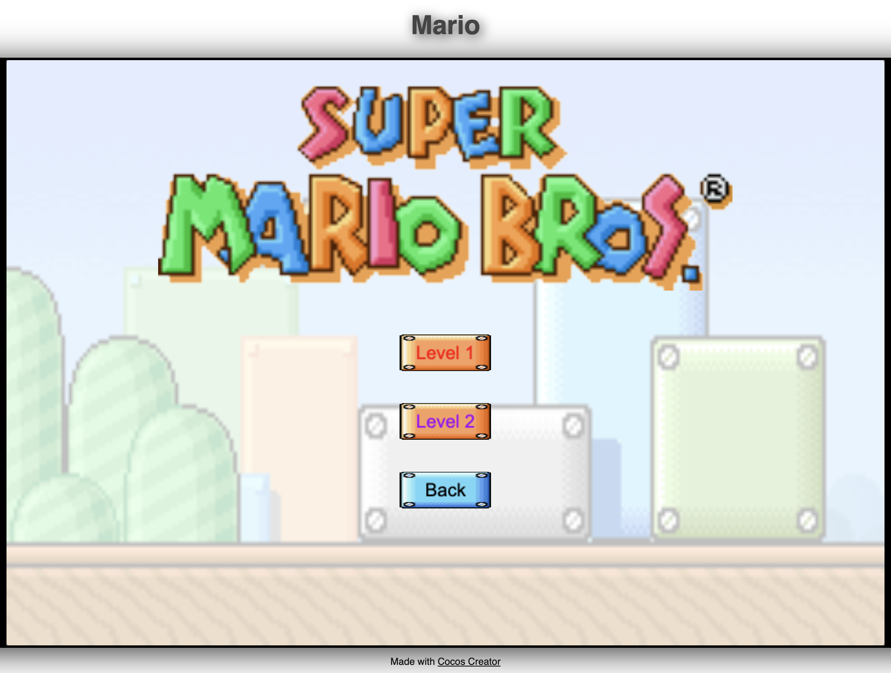
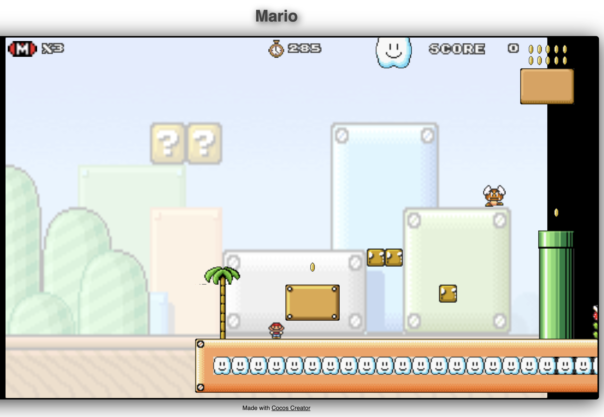
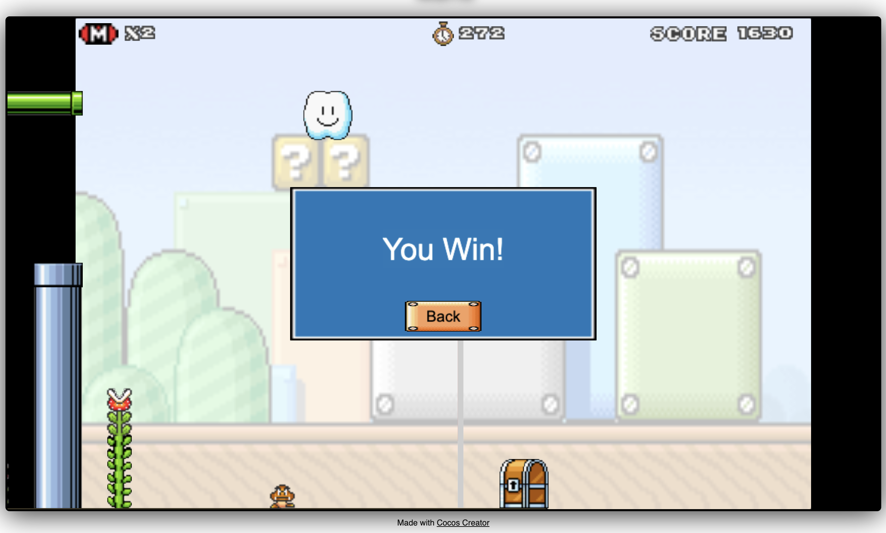
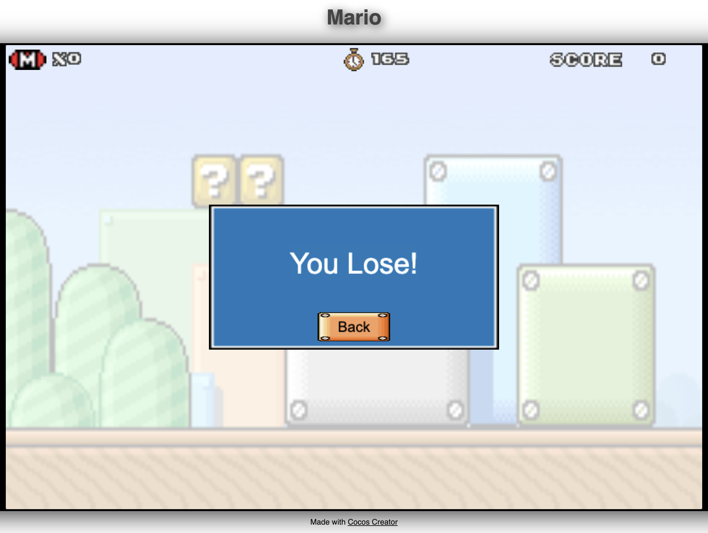
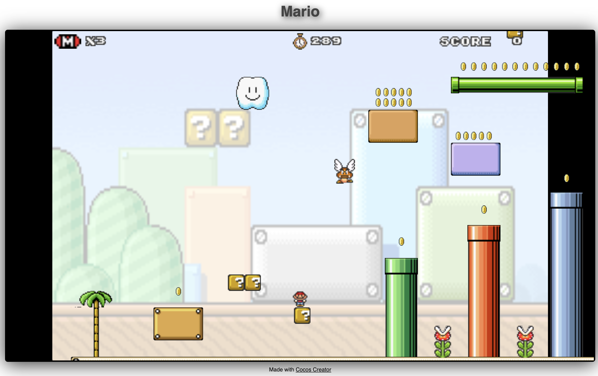
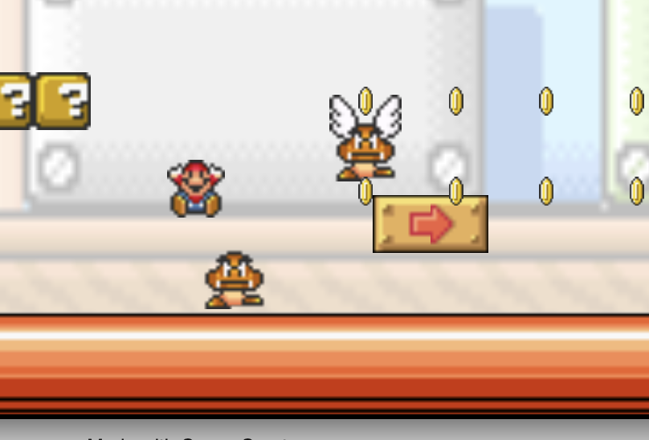
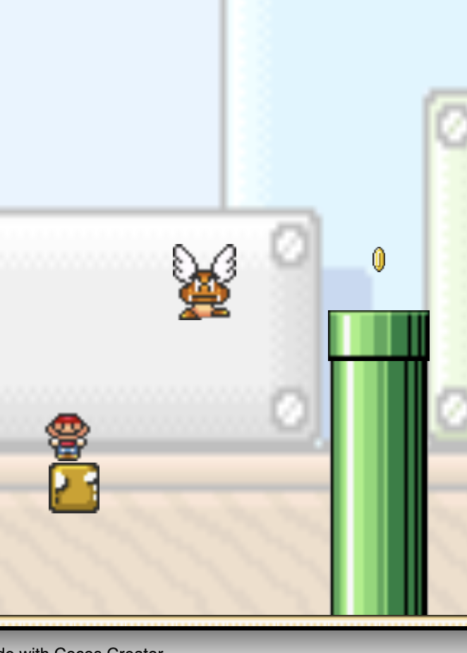
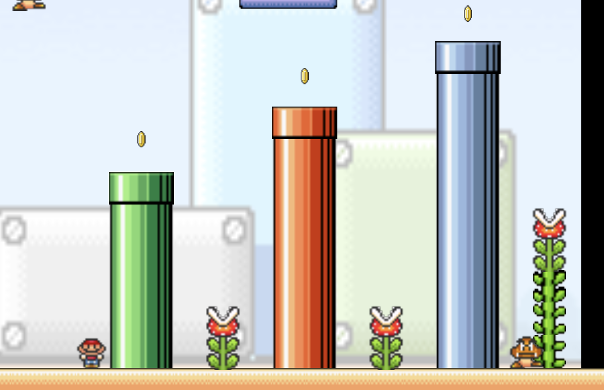

# Software Studio 2024 Spring Assignment 2

## Student ID : 111000223 Name : 黃頂軒

### Scoring

| **Basic Component** | **Score** | **Check** |
| :---: | :---: | :---: |
| Complete Game Process | 5% | Y |
| Basic Rules | 55% | Y |
| Animations | 10% | Y |
| Sound Effects | 10% | Y |
| UI | 10% | Y |

|**Advanced Component**|**Score**|**Check**|
| :---: | :---: | :---: |
| firebase deploy | 5% | Y |
| Leaderboard | 5% | Y |
| Offline multi-player game | 5% | N |
| Online multi-player game | 10% | N |
| Others [name of functions] | 1-10% | Y |

---

## Basic Components Description: 

### Complete Game Process

#### Start Menu

You can select `start` or `leaderboard`. `start` button will take you to the level select scene, and `leaderboard` button will take you to the leaderboard scene.

#### Level Select

After clicking the `start` button in the start menu, you will be taken to this scene, where you can select the level you want to play.

#### Game View

This is the start of the game. You can move the player with arrow keys.

These are the result page when you win/lose.

| Win | Lose |
| :--: | :-: |
|  |  |

### Basic Rules

1. World map : [xxxx]
2. Player : [xxxx]
3. Enemies : [xxxx]
4. Question Blocks : [xxxx]
5. Animations : [xxxx]
6. Sound effects : [xxxx]
7. UI : [xxxx]

#### World Map

- There are two levels in total.
- Physic properties are implemented, therefore player and objects will fall due to gravity, and collide with each other correctly.
- The camera will follow the player's position, keeping Mario in the center of the screen.

#### Level Design

Player can stand on the block due to gravity and collision detection.

The question blocks can interact with the player. If the player hit the question block from below, it will generate either `coin`, `powerup mushroom`, or `health mushroom`.

#### Player

- Control with arrow keys.
- When the player touches enemies or fall out of bounds, the number of its life will decrease.
- Reborn at the initial position after player dies.

#### Enemies

There are three types of enemy.

| Goomba | Flying Goomba | Flower |
| :---: | :---: | :---: |
|  |  |  |
| Goomba will walk left and right randomly. Player can kill Goomba if you hits on its head. | Flying Goomba will fly in the air, using `cc.Animation` effect with `easeInOut` to smooth out when changing direction. Player can kill Flying Goomba if you hits on its head. | Flower will not move, however if you touch it you will die immediately, regardless of power ups. Flowers are immortal, which means you can not kill flowers. |

## Advanced Component Description: 

Describe your advanced function and how to use it.

# Firebase page link (if you deploy)

    your web page URL
